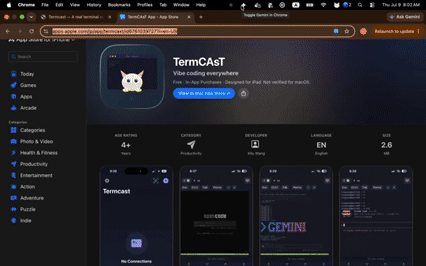
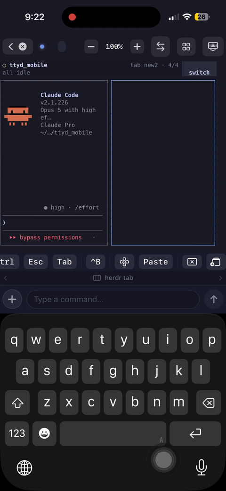
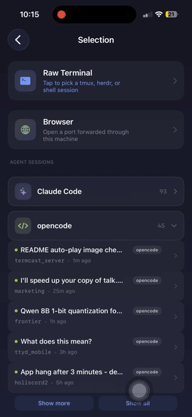

# Termcast Server

The macOS and Linux side of Termcast — a daemon that exposes your terminal to
the Termcast mobile apps over an end-to-end encrypted relay.

Terminal data is encrypted on your machine and decrypted on your phone. The
relay in between forwards ciphertext and never holds a key capable of reading
it. It does terminate the connection, so it sees the metadata any relay must —
your client's IP, its coarse geo-IP location, and its user agent — which the
daemon surfaces in `termcast status` and the menu-bar app.

```
Phone  ⟷  Cloudflare Relay  ⟷  termcast (this repo)  ⟷  local shell
             (untrusted)          your machine
```

The mobile apps and the relay service itself are not part of this repository.

## Demo

<p align="center">
  
</p>

<p align="center">
  
  
</p>

## Install

```bash
curl -fsSL https://ttyd-relay.xing-mathcoder.workers.dev/install.sh | bash
```

Or, with Node.js 24+ already installed:

```bash
npm install -g @termcast/cli
```

## Relay

Termcast ships **no default relay**. The daemon will not start until you point
it at one, either per-run or once in your shell profile:

```bash
termcast start --relay wss://relay.example.com
# or
export TERMCAST_RELAY_URL=wss://relay.example.com
```

The menu-bar app reads `relayUrl` from its `settings.json` instead, since apps
launched from Finder inherit no shell environment — use **Relay settings…** in
the tray menu to open that file.

The relay itself is not part of this repository: it is a small Cloudflare Worker
that authenticates a device by pairing secret and forwards opaque frames between
the two WebSocket legs. `protocol-vectors/` pins the wire format so an
independent implementation can be verified against it.

## Run

```bash
termcast start
```

Scan the QR code with the Termcast app. The QR is also served at
<http://localhost:8080> while the daemon is running. Supported platforms are
macOS and Linux on x64/arm64 (Windows via WSL).

## Commands

```
termcast start                 start the daemon and show the pairing QR
termcast status                connection, clients and relay usage
termcast qr                    print a fresh pairing QR
termcast connect [server]      open a meshed machine in your browser
termcast mesh forwards         list mesh peers and their port forwards
termcast mesh forward <peer> <port[:localPort]>
                               expose a peer's port on this machine (ssh -L)
termcast leave                 leave the cluster (alias: eject)
termcast upgrade               update binaries + server code, then restart
```

Useful `start` flags: `--port` (local terminal port, 7681), `--web-port` (QR
web UI, 8080), `--shell`, `--no-tmux`, `--relay <url>`.

`termcast stop`, `restart` and `logs` come from the wrapper that
`install.sh` writes to `~/.termcast/bin/termcast`; they supervise the
background process and are not subcommands of the Node CLI.

## Repository layout

| Directory | What it is |
|---|---|
| `relay-server/` | `termcast` — the daemon. Manages the local terminal, speaks the relay protocol, does the crypto. |
| `relay-desktop/` | The macOS menu-bar app that supervises the daemon. Electron. |
| `protocol-vectors/` | Known-answer test vectors pinning the wire protocol across implementations. |
| `scripts/` | The installer, plus the release tooling that builds the bundled native binaries (termcastd, tmux). |

## Build from source

Requires Node.js 24 or newer.

```bash
git clone https://github.com/termlabx/termcast_server.git
cd termcast_server/relay-server

npm install     # also downloads termcastd + tmux for your platform
npm run build
npm test
```

Run the daemon straight from the checkout:

```bash
npm run dev -- start
```

The native binaries are fetched automatically by `npm install`. The
`scripts/fetch-*.sh` and `scripts/build-*.sh` helpers exist to populate
`relay-server/bin/` when *publishing* a release, and are not needed for a
normal build.

### The desktop app

```bash
cd relay-desktop
npm install && npm run build
npm start          # run it
```

Packaging (`npm run pack` / `npm run dist`) additionally needs
`relay-server/bin/ttyd-darwin-arm64` present, and `electron-builder.yml` sets
`notarize: true` — so a `dist` build requires your own Apple Developer ID with
`APPLE_ID`, `APPLE_TEAM_ID` and `APPLE_APP_SPECIFIC_PASSWORD` exported. The
maintainer's signing pipeline is not part of this repository, and neither are
its credentials.

## Protocol

Sessions are X25519 ECDH → HKDF-SHA256 → AES-256-GCM. `protocol-vectors/v1.json`
is the wire contract: three independent implementations — TypeScript here,
Swift on iOS, Kotlin on Android — assert against the same bytes, so a port that
diverges fails at build time rather than on a user's phone.

The specific hazard it exists for: CryptoKit's `AES.GCM.SealedBox.combined` is
`nonce ‖ ciphertext ‖ tag`, while Android's `javax.crypto` returns
`ciphertext ‖ tag` with the nonce carried separately. An implementation that
assembles those in the wrong order encrypts and decrypts perfectly against
itself and fails only against the real relay — presenting not as a crypto
error but as a terminal that shows nothing.

Do not hand-edit `v1.json`. It is generated:

```bash
cd relay-server
npm run vectors        # regenerate
npm run vectors:check  # verify in sync (runs in CI, and as part of npm test)
```

See `relay-server/ARCHITECTURE.md` for the traffic path and
`protocol-vectors/README.md` for the vector format.

## Contributing

See [CONTRIBUTING.md](CONTRIBUTING.md). Contributions require agreeing to the
[Contributor License Agreement](CLA.md).

## License

[GNU Affero General Public License v3.0 or later](LICENSE).

This is a strong copyleft license. You may use, study, modify and redistribute
this software freely. If you distribute a modified version — **or run one as a
network service** — you must make the complete corresponding source of your
modified version available under the same license. That network clause is the
reason this project uses the AGPL rather than the GPL.

See [NOTICE](NOTICE) for third-party components and copyright.

Commercial licensing that removes the AGPL obligations is available separately
from ulixlab.
